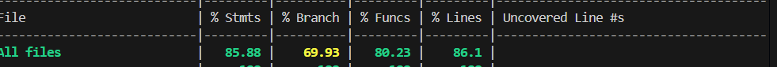

RETROSPECTIVE FOR SPRINT 2 (Team 16)
=====================================

The retrospective should include _at least_ the following
sections:

- [process measures](#process-measures)
- [quality measures](#quality-measures)
- [general assessment](#assessment)

## PROCESS MEASURES 

### Macro statistics

- Number of stories committed vs. done : 4 / 4
- Total points committed vs. done : 10 / 10
- Nr of hours planned vs. spent (as a team): 2w 2d / 2w 2d 56m

**Remember** a story is done ONLY if it fits the Definition of Done:
 
- Unit Tests passing
- Code review completed
- Code present on VCS
- End-to-End tests performed

> Please refine your DoD if required (you cannot remove items!) 

### Detailed statistics

    | Story                            | # Tasks | Points | Hours est.   | Hours actual |
    |----------------------------------|---------|--------|--------------|--------------|
    | _Uncategorized_                  | 19      | //     | 1w 1d 6h 50m | 1w 1d 6h 11m |
    | PT8: Report overview             | 6       | 2      | 5h 50m       | 7h 50m       |
    | PT9: Account config              | 7       | 2      | 6h           | 6h           |
    | PT11: Update report status       | 10      | 1      | 1d 6h 50m    | 2d           |
    | PT12: Create report via telegram | 8       | 5      | 1d 6h 30m    | 1d 4h 55m    |

> story `Uncategorized` is for technical tasks, leave out story points (not applicable in this case)

- Hours per task average, standard deviation (estimate and actual)

|            | Mean | StDev |
|------------|------|-------|
| Estimation | 1.92 | 1.97  |
| Actual     | 1.93 | 1.97  |

- Total estimation error ratio: sum of total hours spent / sum of total hours effort - 1

    $$\frac{\sum_i spent_{task_i}}{\sum_i estimation_{task_i}} - 1 = 0.00972 $$
    
- Absolute relative task estimation error: sum( abs( spent-task-i / estimation-task-i - 1))/n

    $$\frac{1}{n}\sum_i^n \left| \frac{spent_{task_i}}{estimation_task_i}-1 \right| =  0.185 $$
  
## QUALITY MEASURES 

- Unit + Integration Testing:
  - Total hours estimated : 1w 6h
  - Total hours spent : 1w 5h 35m
  - Nr of automated unit test cases : 208
  
- E2E testing:
  - Total hours estimated : 1d 1h
  - Total hours spent : 1d 1h
  - Nr of test cases : 16
- Code review 
  - Total hours estimated : 8
  - Total hours spent : 8
  
## ASSESSMENT

- What did go wrong in the sprint?
  + We had limited communication within the internal groups, which led us to spend more time than expected on some tasks.
- What caused your errors in estimation (if any)?
  + No direct errors in estimation but some bug fixing led us to spend more time than estimated
- What lessons did you learn (both positive and negative) in this sprint?
  + We should communicate more between frontend and backend and check more often that the implemented stories are correct.
  + We also need to read the documentation more carefully so everyone is aligned on routes and implementation details.
- Which improvement goals set in the previous retrospective were you able to achieve? 
  + We resolved all the open issues and completed tests for both old and new stories.
  + We also wrote a clearer and more structured Swagger document to follow during development.
- Which ones you were not able to achieve? Why?
  + We managed to complete all the points we planned to address from the previous sprint.
- Improvement goals for the next sprint and how to achieve them (technical tasks, team coordination, etc.)
  + We should ask for teammates’ approval more often before moving forward with the implementation, so we avoid checking completed stories again due to doubts or inconsistencies.
- One thing you are proud of as a Team!!
  + We adapt well to new decisions and tend to share a similar approach to task estimation and implementation logic. Even when opinions differ, we manage to reach a unified and effective final decision.