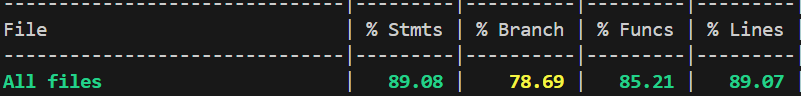

RETROSPECTIVE FOR SPRINT 3 (Team 16)
=====================================

The retrospective should include _at least_ the following
sections:

- [process measures](#process-measures)
- [quality measures](#quality-measures)
- [general assessment](#assessment)

## PROCESS MEASURES 

### Macro statistics

- Number of stories committed vs done : 5 / 5
- Total points committed vs done : 31 / 31
- Nr of hours planned vs spent (as a team) : 2s 2d 30m / 2s 1d 7o 20m

**Remember**  a story is done ONLY if it fits the Definition of Done:
 
- Unit Tests passing
- Code review completed
- Code present on VCS
- End-to-End tests performed
- SonarCloud review passing

> Please refine your DoD
 
### Detailed statistics

| Story | # Tasks | Points | Hours est. | Hours actual |
|-------|---------|--------|------------|--------------|
| _#0_  | 11      | -      | 1s 1g 15m  | 1s 7o 40m    |
| PT-24 | 7       | 3      | 7h         | 7h           |
| PT-25 | 6       | 2      | 5h 15m     | 5h 15m       |
| PT-26 | 9       | 13     | 1d 7h 30m  | 1d 4h 30m    |
| PT-27 | 8       | 5      | 1d         | 7h 55m       |
| PT-10 | 7       | 8      | 1d 30m     | 1g 1h 30m    |

> place technical tasks corresponding to story `#0` and leave out story points (not applicable in this case)

|            | Mean | StDev |
|------------|------|-------|
| Estimation | 1.78 | 1.76  |
| Actual     | 2.01 | 1.99  |

- Total estimation error ratio: sum of total hours spent / sum of total hours effort - 1

    $$\frac{\sum_i spent_{task_i}}{\sum_i estimation_{task_i}} - 1 = -0.012 $$
    
- Absolute relative task estimation error: sum( abs( spent-task-i / estimation-task-i - 1))/n

    $$\frac{1}{n}\sum_i^n \left| \frac{spent_{task_i}}{estimation_task_i}-1 \right| =  0.120 $$

  
## QUALITY MEASURES 

- Unit Testing:
  - Total hours estimated: 5h 15m
  - Total hours spent: 5h 15m
  - Nr of automated unit test cases: 518
  - Coverage (if available): 
- Integration testing:
  - Total hours estimated: 6h 30m
  - Total hours spent: 6h 25m
- E2E testing:
  - Total hours estimated: 3h 30m
  - Total hours spent 3h 30m
- Code review:
  - Total hours estimated : 5h 
  - Total hours spent: 5h
- Technical Debt management:
  - Strategy adopted:
    > Hours split
    - 5 hours for code review
    - 5 hours for bugfixing
    - 5 hours for refactoring
    > Issue Priority
    - First Criteria: business value of related story
    - Second Criteria: issue category
      - Security
      - Reliability
      - Maintainability
    - Third Criteria: issue severity
    - Fourth Criteria: required effort

  - Total hours estimated estimated at sprint planning: 1d 7h
  - Total hours spent: 1d 7h 30m
  
## ASSESSMENT

- What caused your errors in estimation (if any)?
  - No significant error in time estimation, but few tasks required more time due to inexperience with chat implementation
- What lessons did you learn (both positive and negative) in this sprint?
  - We learned to clean unused branches on the GitHub repository more frequently
  - We need to be more careful during estimation, to avoid minimal errors in the total estimated time
  - We can handle changes and issues quickly and efficiently, so if unforeseen problems show up the team is not slowed down and can maintain momentum.
- Which improvement goals set in the previous retrospective were you able to achieve? 
  - We improved comunication between internal groups especially before and after a task is respectively started or completed or when a doubt shows up.
- Which ones you were not able to achieve? Why?
  - All the goals set from previous sprint have been satisfied.
- Improvement goals for the next sprint and how to achieve them (technical tasks, team coordination, etc.)
  - We need to handle branches on the github repository more efficiently, to avoid merge conflicts which can take a lot of time to be solved
- One thing you are proud of as a Team!!
  - We're really prod of us as a team because we're confirming we can manage to complete each story and task in the backlog sprint in most of cases with really not significant time estimation errors.
  - We're also proud to share that, as weeks pass by, we show more commitment for the tasks each one is involved into but also interest for the ones we are not.
