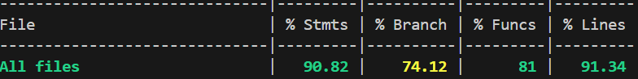

RETROSPECTIVE FOR SPRINT 4 (Team 16)
=====================================

The retrospective should include _at least_ the following
sections:

- [process measures](#process-measures)
- [quality measures](#quality-measures)
- [general assessment](#assessment)

## PROCESS MEASURES 

### Macro statistics

- Number of stories committed vs done : 10 / 10
- Total points committed vs done : 39 / 39
- Nr of hours planned vs spent (as a team) : 2s 2d / 2s 2d 2h 20m

**Remember**  a story is done ONLY if it fits the Definition of Done:
 
- Unit Tests passing
- Code review completed
- Code present on VCS
- End-to-End tests performed
- SonarCloud review passing

> Please refine your DoD
 
### Detailed statistics

| Story | # Tasks | Points | Hours est. | Hours actual |
| ----- | ------- | ------ | ---------- | ------------ |
| _#0_  | 15      | -      | 1w 2d 1h   | 1w 2d 1h 25m |
| PT-28 | 6       | 1      | 3h 30m     | 2h 25m       |
| PT-24 | 1       | 3      | 10m        | 10m          |
| PT-15 | 5       | 1      | 3h         | 2h 55m       |
| PT-30 | 4       | 5      | 4h         | 4h 20m       |
| PT-13 | 3       | 3      | 6h         | 6h           |
| PT-14 | 2       | 3      | 2h         | 2h           |
| PT-18 | 4       | 5      | 4h         | 5h 50m       |
| PT-16 | 6       | 5      | 6h         | 6h           |
| PT-17 | 2       | 3      | 5h         | 5h           |
| PT-19 | 3       | 5      | 3h         | 2h 45m       |
| PT-20 | 2       | 5      | 2h 20m     | 3h 30m       |

> place technical tasks corresponding to story `#0` and leave out story points (not applicable in this case)

|            | Mean   | StDev  |
| ---------- | ------ | ------ |
| Estimation | 1.8113 | 2.351 |
| Actual     | 1.8600 | 2.394 |

- Total estimation error ratio: sum of total hours spent / sum of total hours effort - 1

    $$\frac{\sum_i spent_{task_i}}{\sum_i estimation_{task_i}} - 1 =  0.0269$$
    
- Absolute relative task estimation error: sum( abs( spent-task-i / estimation-task-i - 1))/n

    $$\frac{1}{n}\sum_i^n \left| \frac{spent_{task_i}}{estimation_task_i}-1 \right| =  0.1374 $$

  
## QUALITY MEASURES 

- Unit Testing:
  - Total hours estimated: 5h
  - Total hours spent: 4h 10m
  - Nr of automated unit test cases: 910
  - Coverage (if available): 
- Integration testing:
  - Total hours estimated: 4h
  - Total hours spent: 3h 40m
- E2E testing:
  - Total hours estimated: 1d 50m
  - Total hours spent 7h 45m
- Code review:
  - Total hours estimated : 5h 
  - Total hours spent: 5h 25m
- Technical Debt management:
  - Strategy adopted:
    > Hours split
    - 5 hours for code review
    - 5 hours for bugfixing
    - 5 hours for refactoring
    > Issue Priority
    - First Criteria: business value of related story
    - Second Criteria: issue category
      - Security
      - Reliability
      - Maintainability
    - Third Criteria: issue severity
    - Fourth Criteria: required effort

  - Total hours estimated estimated at sprint planning: 1d 7h
  - Total hours spent: 1d 7h 40m
  
## ASSESSMENT

- What caused your errors in estimation (if any)?
  - There were no significant errors in the estimation
- What lessons did you learn (both positive and negative) in this sprint?
  - With a good planning, after having clear what each one of us can do better, we are able to do a large amount of work in a clean and efficient way.
  - E2E testing should be done immediately after a feature is completed, to identify bugs as soon as possible.
- Which improvement goals set in the previous retrospective were you able to achieve? 
  - We managed to split work and tasks better, avoiding conflits and improving the workflow.
  - We were more careful during the usage of YouTrack, avoiding errors in the total hours count.
- Which ones you were not able to achieve? Why?
  - All the goals set from previous sprint have been satisfied.
- Improvement goals for the next sprint and how to achieve them (technical tasks, team coordination, etc.)
  - Documentation Updates are what can stop the frontend development, so trying to complete them earlier could allow frontend development to start earlier.
- One thing you are proud of as a Team!!
  - During this sprint we have been able to work very efficiently without conflicts and with better communication, implementing a great number of features and reducing Technical Debt almost to zero. We believe we finally found the right pace!
