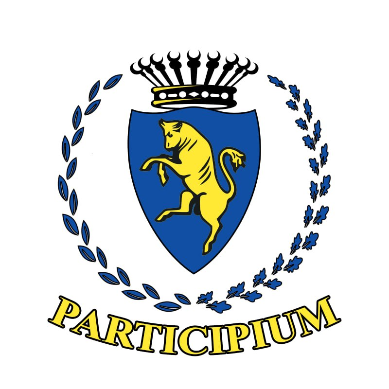

# Participium

## Description
Civic reporting platform for the city of Turin, enabling citizens to report urban issues and allowing municipal officers to review and manage them. Exam Project for the course "Software Engineering II" at Politecnico di Torino, Italy

## Details
Look at the README.md file in the /Participium repository for details on the project structure, setup instructions, user roles and features